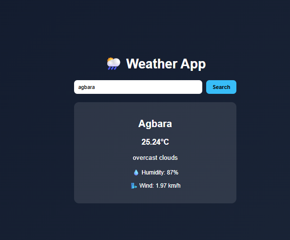

🌦️ Weather App

A simple and responsive weather application that displays real-time weather information using the OpenWeather API.
It also supports auto-location detection and city search.

[🚀 Live Demo]
https://paulwebsdev.github.io/Weather-App/

📸 Screenshot

✨ Features
🌍 Auto-detect user location (GPS)
🔍 Search weather by city name
🌡️ Temperature in Celsius
💧 Humidity display
🌬️ Wind speed info
⚠️ Error handling for invalid cities
📱 Fully responsive design
🛠️ Built With
HTML5
CSS3
JavaScript (ES6)
OpenWeather API
🔑 API Setup

This project uses OpenWeather API.

Get your API key from:
https://openweathermap.org/
weather-app/
│
├── index.html
├── style.css
├── script.js
└── README.md
⚙️ How to Run Locally
Clone the repository:
git clone https://github.com/your-username/weather-app.git
Open index.html in your browser
📈 What I Learned
Working with APIs
Fetching real-time data
DOM manipulation
Geolocation API
Error handling in JavaScript
👨‍💻 Author

Paul Bamigbaye
Frontend Developer

🌐 Portfolio: https://paulwebsdev.github.io/portfolio/
🐙 GitHub: https://github.com/paulwebsdev
📧 Email: paulbamigbaye@gmail.com
⭐ Support

If you like this project, give it a ⭐ on GitHub!
